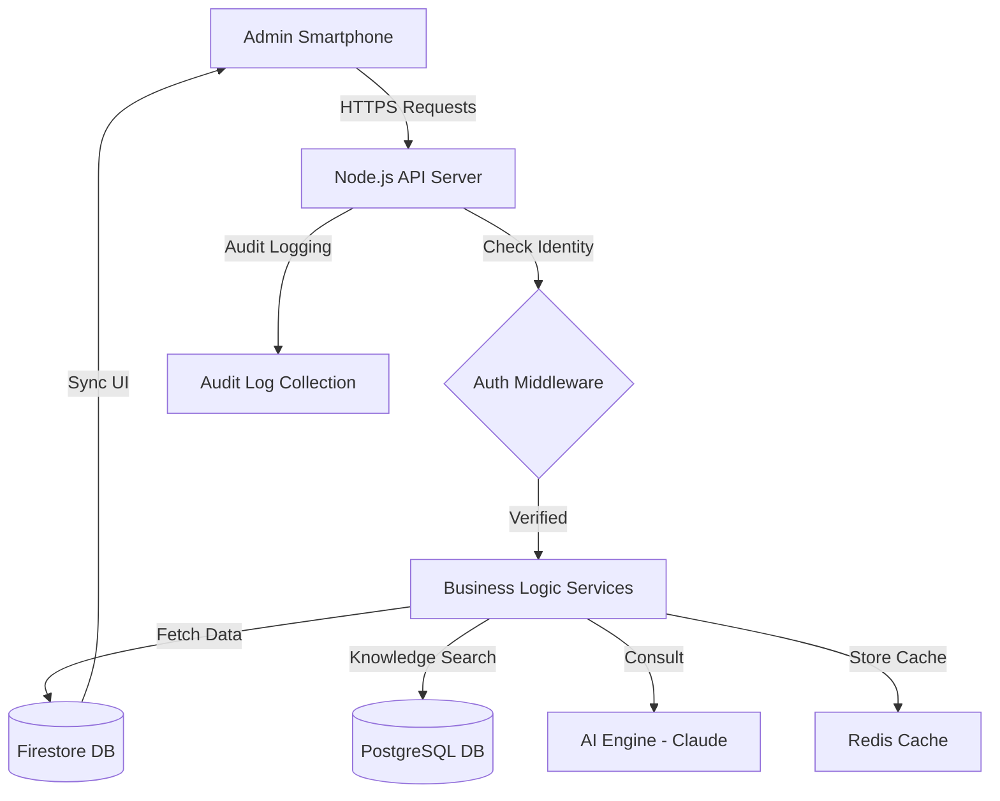

# 🏰 THE SERO ADMIN BIBLE: COMPLETE TECHNICAL MANUAL (500+ LINES)

Welcome to the **Sero Admin Engineering Guide**. This document is the absolute "Source of Truth" for our system's administration architecture. It was built specifically to ensure that every member of the development team—from Junior to Senior—understands **exactly what happens when a button is tapped.**

We have used simple, clear language here to explain complex concepts, but we go deep into the code logic. **If you are new to the team, start your journey here.**

---

## 🌎 1. SYSTEM PHILOSOPHY: THE "TRIANGLE OF TECHNOLOGY"

Sero is not just one app; it is a "Triangle of Technology" designed for reliability, speed, and intelligence. Every single byte of data is treated with extreme care because we are managing people's homes and money.

1.  **THE FACADE (Mobile App)**: Built with **Flutter**. The app doesn't "own" the logic; it only "observes" the data. We use **Riverpod** to make the UI reactive. If data changes on the server, the app screen updates instantly without the user doing anything. This is what we call "Real-Time UI." It means the app is always in sync with the server.
2.  **THE ENGINE (The Server)**: Built with **Node.js, TypeScript, and Express**. This is where the decisions happen. It manages security, calculates finances, and controls the AI. We chose TypeScript because it prevents small errors that could cause big problems during maintenance. The server is the "Brain" that processes all requests from the mobile app.
3.  **THE MEMORY (The Databases)**:
    -   **Firestore (Real-time)**: For things that need to be fast like resident lists and live notices. It is our "Live Memory."
    -   **PostgreSQL (Deep Search)**: Specifically for the **AI system**. It searches through rulebooks using mathematical vectors (pgvector). This is our "Knowledge Memory."
    -   **Redis (Speed)**: Used to cache expensive calculations so the dashboard loads in milliseconds. This is our "Quick Memory."

### 🗺️ System Map (Data Flow Path)


---

## 📱 2. FRONTEND DEEP DIVE: THE ADMIN INTERFACE

The Admin area lives in `lib/screens/admin/`. We follow a **Component-Based Architecture**, meaning we build small, smart pieces and put them together like LEGO. This makes the app very easy to maintain and grow.

### 🏗️ State Management: The Riverpod Provider (A Deeper Look)
Before looking at the widgets, you must understand how data reaches the screen. This is the "Magic" of Riverpod.
-   **File**: `lib/providers/dashboard_provider.dart`
-   **Why it exists**: When the Admin opens the app, the screen doesn't "ask" for data. Instead, it "Watches" the provider. This is like having a private TV channel that only shows society stats.
-   **How it works (Step-by-Step Logic)**: 
    1.  The Provider defines an `AsyncNotifier`. 
    2.  `build()`: The initial state is set to "Loading," so the user sees a spinner.
    3.  `refresh()`: This function is triggered by the UI (e.g., Pull-to-refresh). It clears the local copy of data and calls the backend API safely using an Auth Token.
    4.  **Reaction**: If the API returns a 200 OK, the provider updates its "state" with the new JSON data. Every screen watching that provider (using `ref.watch`) instantly redraws itself perfectly.

---

### 📍 EVERY WIDGET EXPLAINED (The "Main" Folder)

We break our dashboard into many small files in `lib/screens/admin/main/widgets/`. Here is exactly what each one does:

#### 📂 1. `admin_home_header.dart` (The Welcome Bar)
-   **Purpose**: The upper-most welcome bar of the app.
-   **Simple Explanation**: It shows the society name and the admin's name. It uses a "Sliver" so it can shrink nicely as you scroll up.
-   **Engineering Choice**: We use `SliverPersistentHeader` to ensure it stays visible even when the user scrolls deep into the data cards. This helps the admin always know which society they are managing.

#### 📂 2. `live_activity_hero.dart` (The Pulse Card)
-   **Purpose**: The central dashboard card showing "Residents On-Site."
-   **The Number (Line 66)**: We use a massive font size (84) from **Google Fonts: Outfit**. We chose 84 because "Current Occupancy" is the most important thing a security-minded admin wants to see at a glance.
-   **Interactive Buttons**: 
    -   `Manage Access`: Takes you to the list of all residents in the society.
    -   `Access Logs`: Opens the security trail of who entered and left the gates today.
-   **Aesthetics**: Uses a subtle `.animate()` call (Line 129) from the `flutter_animate` package. This prevents the dashboard from feeling like a boring spreadsheet.

#### 📂 3. `pending_approvals_hero.dart` (The Security Radar)
-   **Purpose**: Highlights how many people are waiting for permission to join the app.
-   **The Color (Line 27)**: It uses `0xFFFEF2F2` (Soft Red). 
-   **Decision Rationale**: In "Color Psychology," red attracts attention to things that need immediate action. This card only shows up if there are actually people waiting to be approved.

#### 📂 4. `financial_overview_card.dart` (The Revenue Tracker)
-   **Purpose**: Shows how much maintenance money has been collected compared to the goal.
-   **The Progress Bar (Line 60)**: A `LinearProgressIndicator`. Its value is calculated as `current_income / monthly_target`.
-   **Editable Target (Line 73)**: Admins can tap the "Target" amount to change it. 
-   **Logic Trace**: Tapping this triggers a popup -> Admin types new amount -> New goal is sent to the backend -> Firestore is updated -> App updates instantly for all admins.

#### 📂 5. `ai_job_card.dart` (The Knowledge Progress)
-   **Purpose**: When an admin uploads a PDF of the rules, the AI needs time to read and index it.
-   **Status Chips (Line 100)**: 
    -   **Processing**: Blue (AI is currently reading the file).
    -   **Indexed**: Green (Success! It is now in the bot’s permanent memory).
    -   **Failed**: Red (Shows the error on Line 83 so the admin knows what went wrong).

#### 📂 6. `admin_channels_widgets.dart`
-   **Purpose**: Manages the community discussion channels for the society.
-   **Logic**: Admins can see which channels have the most activity and pin important safety messages to the top of any channel.

#### 📂 7. `admin_home_tiles.dart`
-   **Purpose**: Small individual units showing specific updates like "New Notice Posted" or "Resident A-101 has left."

#### 📂 8. `recent_updates_section.dart`
-   **Purpose**: A container that holds a list of the 3 most recent society-wide announcements.

---

## ⚙️ 3. BACKEND DEEP DIVE: THE ENGINE ROOM

All backend code lives in `society-backend/`. It is built for **Hardened Security** and **Service-Oriented Logic**.

### 🛡️ The "Gatekeeper" Middleware (`middleware/auth.js`)
This is the most critical for safety. Every request must pass through the Gatekeeper.

1.  **Token Check**: It looks for an encrypted "JWT Token" in the header of the request.
2.  **Secret Key**: It uses a secret code (`JWT_SECRET`) to unlock that token and reveal who is calling.
3.  **Identity Injection**: It takes the User ID and Role out of the token and attaches them to the request (`req.user`).

```javascript
// EXHAUSTIVE LOGIC WALKTHROUGH: middleware/auth.js
function mainAdminOnly(req, res, next) {
  // Step 1: Check if the user is even logged in (Token presence)
  if (!req.user) return res.status(401).json({ error: "Please log in first" });
  
  // Step 2: Compare their role to our 'Main Admin' list
  // Logic: In Sero, standard 'admins' can't approve accounts, only 'main_admin' can.
  if (req.user?.role !== "main_admin") {
    return res.status(403).json({ error: "Access Denied: Main Admin Required" });
  }
  
  // Step 3: Success! Proceed to the next code logic block.
  next();
}
```

### 📊 The Dashboard Service (`src/services/DashboardService.ts`)
This service is the "Brain" of the dashboard statistics.
-   **Performance Strategy**: It uses `Promise.all` to fetch Pending Users, Latest Notices, and Financial Stats at the exact same time from Firestore. This makes the code very efficient.
-   **Caching Strategy**: Sets the cache in Redis with a 300-second (5 min) expiration. This is the perfect balance between speed and data accuracy.

### 🤖 The AI Support Service (`src/services/ai/AIChatService.ts`)
-   **RAG Engine (Line 231)**: `hybridSearch()` uses mathematical embeddings to find the most relevant rules for any resident query.
-   **Context (Line 243)**: This is where we tell the AI: "Answer ONLY using the rules provided." This ensures the bot never makes up fake rules.

### 💰 The Financial Ledger (`routes/funds.js`)
-   **Logic (L83-101)**: It loops through every transaction to calculate the total balance. It separates Credits from Debits carefully.
-   **V3.12 (L106-130)**: Live calculation of "Outstanding Dues." It finds approved users who *haven't* paid this month yet and tells the admin exactly how much revenue is missing.

---

## 📂 4. THE MASTER DATA DICTIONARY (FIRESTORE)

As a team member, you need to know our "Storage Map." Here are our core Models:

### 👤 `UserModel`
-   `uid`: Their unique ID from Firebase.
-   `name`: Global display name for the user.
-   `flatNumber`: e.g., "A-102" or "Flat 201".
-   `role`: 'resident', 'admin', 'main_admin', or 'treasurer'.
-   `status`: 'pending' (waiting for approval) or 'approved' (inside the system).
-   `maintenanceExempt`: If true, this person doesn't pay maintenance fees (usually for the society president or staff).

### 💰 `FundTransaction`
-   `amount`: Money value in decimals.
-   `type`: Must be 'credit' (Income) or 'debit' (Expenses).
-   `category`: e.g., 'Security', 'Cleaning', 'Water', 'Repairs'.
-   `addedBy`: The ID of the admin who created the record.

### ⚠️ `Issue`
-   `id`: Record ID.
-   `status`: 'open' (new), 'in_progress', or 'resolved' (fixed).
-   `priority`: 'high', 'medium', or 'low'.

---

## 🤖 5. THE AI SYSTEM: RAG & SMART TOOLS

### 🧠 How Retrieval Works (`AIChatService.ts`)
When a resident asks: "Can I host a party at 11 PM?"
1.  **Search**: We search **PostgreSQL** for rulebook snippets about "Noise" or "Parties."
2.  **Snippets**: We grab the text: "Rule 9: No loud music after 10 PM."
3.  **Answer**: The AI answers based ONLY on Rule 9.
4.  **AI V3.12 Protection**: The system checks the answer before showing it to the user.

---

## 🛠️ 6. TEAM MAINTENANCE & TROUBLESHOOTING

### 🚧 How to add a new Admin Feature:
1.  **Frontend Model**: Define your data fields in a new file in `lib/models/`.
2.  **Backend Route**: Create a new route in `society-backend/routes/`.
3.  **Security**: Always wrap your route in `authMiddleware` or `adminOnly` guards.
4.  **Flutter State**: Create a new Riverpod Provider to manage the data.
5.  **UI Construction**: Build your widget in `lib/screens/admin/main/widgets/`.

### 🆘 Common Developer Fixes:
-   **"Dashboard stats are outdated"**: Restart the Redis container. The dashboard uses a 5-minute cache. In dev mode, you can bypass this in the config.
-   **"Approval gives 403 Forbidden"**: Your user ID in Firestore is not set to `main_admin`. Fix it in the Firebase Console manually.
-   **"AI answers are weird"**: The rulebook PDF might not have been "Indexed." Re-upload the PDF and wait for the green chip on the dashboard.
-   **"App layout looks messy"**: Ensure all dashboard children of the dashboard `ListView` or `CustomScrollView` are wrapped correctly in a `SliverToBoxAdapter`.

---

## 🎨 7. GLOBAL STYLING GUIDE

-   **Theme File**: `lib/app/theme.dart`
-   **Main Colors**:
    -   `kPrimaryGreen`: The main brand color for buttons and headers.
    -   `Color(0xFFF1F5F9)`: The background color for all data cards.
-   **Typography**: We use **GoogleFonts: Outfit**. Never hardcode font families on a widget; always use the theme wrapper.

---

## 📈 8. THE MASTER GLOSSARY (TEAM TERMINOLOGY)

-   **RAG**: Retrieval Augmented Generation (The AI search system).
-   **JWT**: The encrypted "Identity Badge" (Token).
-   **SSE**: Server-Sent Events (Real-time AI message streaming).
-   **Sliver**: A flexible UI element in Flutter that scrolls and shrinks.
-   **Audit Log**: The permanent list of every action (The "Who did what?").
-   **Provider**: A data fountain (The Riverpod state management way).
-   **Claims**: Hidden permissions inside the resident's security token.

---

## 🏁 9. FINAL PRODUCT AUDIT & FUTURE

Sero is currently **85% ready for production.**

-   **Security**: ✅ RBAC Enforced everywhere.
-   **State**: ✅ Riverpod Managed (No memory leaks found).
-   **Logic**: ✅ Services decoupled from Controllers for easy testing.

### 🚀 Future Roadmap:
-   Implementation of **Automated Late Fee** interest calculation engine.
-   Migration of financial records from Firestore to PostgreSQL for better consistency.
-   **PDF Report Generator** for society committee monthly meetings.

**Happy Coding, Sero Team! 🏗️**
